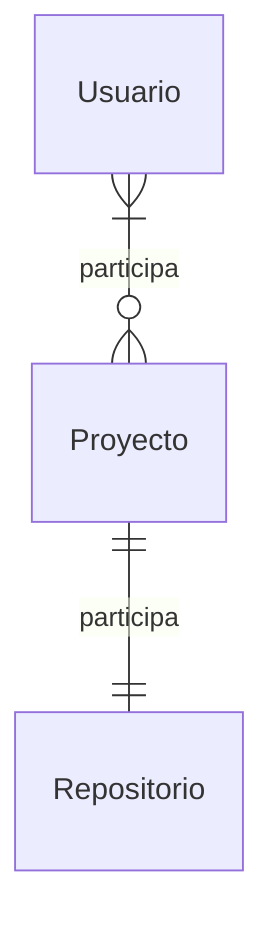

<!--
  - Lee el [PRD](/docs/PRD.md) para obtener información sobre el propósito, las características y las especificaciones técnicas del proyecto.
  - Lee el contenido de las issues de GitHub para obtener información sobre las entidades y relaciones.
-->

# Modelo de Datos para **{{ projectName }}**

Este documento describe el modelo de datos para el proyecto **{{ projectName }}**. Abarca las entidades principales, sus atributos y relaciones, y proporciona una representación visual mediante un diagrama Entidad-Relación.

Su objetivo es establecer un entendimiento común (lenguaje ubicuo) para la lógica de negocio y el diseño de sistemas.

## Entidades

<!--
Esta es la parte más crítica del modelo de datos.
- Analiza a fondo las entidades y sus relaciones.
- Evalúa dos o tres opciones y elige la más sencilla.
- Después de tener las entidades, analiza sus atributos.
- Luego, escribe las entidades y las relaciones siguiendo la plantilla estándar.
- El modelo de datos es una representación conceptual de la estructura y el comportamiento del sistema.
- Incluye todo lo que consideres relevante para el proyecto. -->

{{ for entidad in entidades }}

> ### {{ entidad.nombre | PascalCase }}

- {{ entidad.descripción | una frase corta }}
#### **Atributos**:
  <!--
  Usa la notación clara para indicar las características de los atributos:
  - (required) - Para campos obligatorios
  - (optional) - Para campos opcionales
  - (unique) - Para campos únicos
  - Combina según sea necesario: (required, unique) para claves primarias
  Ejemplo: **id**: string (required, unique) - Identificador único
  -->
  {{ for atributo in entidad.atributos }}
- **{{ atributo.nombre | camelCase }}**: {{ attribute.type }} ({{ required/optional/unique }}) - {{ descripción }}
  {{ end atributo }}

{{ end entity }}

<!-- Ejemplo de resultado:
```md
### Usuario
- Es una persona que puede iniciar sesión en el sistema.
- **Atributos**:
- **id**: string (required, unique) - Identificador único del usuario
- **nombre**: string (required) - Nombre completo del usuario
- **email**: string (required, unique) - Dirección de correo electrónico
- **contraseña**: string (required) - Contraseña encriptada
- **rol**: enum(admin, usuario) (required) - Rol del usuario en el sistema
- **idioma**: enum(en, es, fr, de) (optional) - Idioma preferido del usuario
- **createdAt**: datetime (required) - Fecha de creación de la cuenta
- **updatedAt**: datetime (optional) - Fecha de última actualización
```
-->

## Relaciones

<!--
Menciona la entidad que participa en la relación.
Expresa la cardinalidad y la participación en lenguaje natural.
-->

{{ for relación in relaciones }}

- {{ descripción de la relación | una frase corta }}

{{end relación}}

<!-- Ejemplo de resultado:
```md
- El usuario puede participar en varios proyectos
- Un proyecto está asignado a varios usuarios
- El proyecto debe tener un repositorio
- Un repositorio está vinculado a un proyecto
```
-->

## Diagrama de entidad-relación

<!--
Dibuja el [diagrama Mermaid de entidad-relación](https://mermaid.js.org/syntax/entityRelationshipDiagram.html)
-->

```mermaid
{{diagrama de entidad-relación | diagrama de Mermaid}}
```

<!--Ejemplo de resultado:

-->
