# Modelo de Datos para **The Natural Way Backend**

Este documento describe el modelo de datos para el proyecto **The Natural Way Backend**. Abarca las entidades principales, sus atributos y relaciones, y proporciona una representación visual mediante un diagrama Entidad-Relación.

Su objetivo es establecer un entendimiento común (lenguaje ubicuo) para la lógica de negocio y el diseño de sistemas.

## Entidades

> ### Usuario

- Es una persona que puede iniciar sesión en el sistema y gestionar sus entrenamientos.
#### **Atributos**:
- **id**: string (required, unique) - Identificador único del usuario
- **username**: string (required, unique) - Nombre de usuario para inicio de sesión
- **email**: string (required, unique) - Dirección de correo electrónico
- **password**: string (required) - Contraseña encriptada
- **firstName**: string (optional) - Nombre del usuario
- **lastName**: string (optional) - Apellidos del usuario
- **dateOfBirth**: date (optional) - Fecha de nacimiento
- **gender**: enum(male, female, other) (optional) - Género del usuario
- **height**: decimal (optional) - Altura en centímetros
- **weight**: decimal (optional) - Peso corporal en kilogramos
- **isActive**: boolean (required) - Indica si la cuenta está activa
- **createdAt**: datetime (required) - Fecha de creación de la cuenta
- **updatedAt**: datetime (optional) - Fecha de última actualización

> ### Ejercicio

- Representa un ejercicio físico que puede ser utilizado en rutinas y sesiones de entrenamiento.
#### **Atributos**:
- **id**: string (required, unique) - Identificador único del ejercicio
- **name**: string (required) - Nombre del ejercicio
- **description**: text (optional) - Descripción detallada del ejercicio
- **movementType**: enum(push, pull, squat, hinge, carry, other) (optional) - Tipo de movimiento principal
- **primaryMuscleGroup**: enum(chest, back, shoulders, arms, legs, core, full_body, other) (optional) - Grupo muscular principal
- **secondaryMuscleGroups**: array (optional) - Grupos musculares secundarios
- **equipment**: enum(barbell, dumbbell, cable, machine, bodyweight, kettlebell, other) (optional) - Equipamiento necesario
- **difficulty**: enum(beginner, intermediate, advanced) (optional) - Nivel de dificultad
- **instructions**: text (optional) - Instrucciones de ejecución
- **imageUrl**: string (optional) - URL de imagen del ejercicio
- **videoUrl**: string (optional) - URL de video demostrativo
- **isActive**: boolean (required) - Indica si el ejercicio está activo
- **createdBy**: string (optional) - Usuario que creó el ejercicio
- **createdAt**: datetime (required) - Fecha de creación
- **updatedAt**: datetime (optional) - Fecha de última actualización

> ### Rutina

- Representa un plan de entrenamiento estructurado con semanas, días y ejercicios.
#### **Atributos**:
- **id**: string (required, unique) - Identificador único de la rutina
- **name**: string (required) - Nombre de la rutina
- **description**: text (optional) - Descripción de la rutina
- **durationWeeks**: integer (optional) - Duración de la rutina en semanas
- **durationMonths**: integer (optional) - Duración de la rutina en meses
- **isActive**: boolean (required) - Indica si la rutina está activa
- **createdBy**: string (required) - Usuario que creó la rutina
- **createdAt**: datetime (required) - Fecha de creación
- **updatedAt**: datetime (optional) - Fecha de última actualización

> ### Semana

- Representa una semana dentro de una rutina de entrenamiento.
#### **Atributos**:
- **id**: string (required, unique) - Identificador único de la semana
- **routineId**: string (required) - Rutina a la que pertenece la semana
- **weekNumber**: integer (required) - Número de semana dentro de la rutina
- **notes**: text (optional) - Notas específicas para esta semana
- **createdAt**: datetime (required) - Fecha de creación
- **updatedAt**: datetime (optional) - Fecha de última actualización

> ### Día

- Representa un día de entrenamiento dentro de una semana de rutina.
#### **Atributos**:
- **id**: string (required, unique) - Identificador único del día
- **weekId**: string (required) - Semana a la que pertenece el día
- **dayNumber**: integer (required) - Número de día dentro de la semana
- **name**: string (optional) - Nombre del día (ej: "Día 1", "Push Day")
- **notes**: text (optional) - Notas específicas para este día
- **createdAt**: datetime (required) - Fecha de creación
- **updatedAt**: datetime (optional) - Fecha de última actualización

> ### Bloque

- Representa un bloque o grupo de ejercicios dentro de un día de entrenamiento (ej: "Pecho + Tríceps").
#### **Atributos**:
- **id**: string (required, unique) - Identificador único del bloque
- **dayId**: string (required) - Día al que pertenece el bloque
- **name**: string (required) - Nombre del bloque
- **order**: integer (required) - Orden del bloque dentro del día
- **notes**: text (optional) - Notas específicas para este bloque
- **createdAt**: datetime (required) - Fecha de creación
- **updatedAt**: datetime (optional) - Fecha de última actualización

> ### EjercicioEnRutina

- Representa un ejercicio específico dentro de un bloque de una rutina, con sus parámetros de entrenamiento planificados.
#### **Atributos**:
- **id**: string (required, unique) - Identificador único
- **blockId**: string (required) - Bloque al que pertenece el ejercicio
- **exerciseId**: string (required) - Ejercicio de la biblioteca
- **order**: integer (required) - Orden del ejercicio dentro del bloque
- **sets**: integer (optional) - Número de series planificadas
- **repetitions**: string (optional) - Repeticiones planificadas (puede ser un rango, ej: "8-12")
- **weight**: decimal (optional) - Peso planificado en kilogramos
- **weightPercentage**: decimal (optional) - Porcentaje del 1RM a utilizar
- **tempo**: string (optional) - Tempo de ejecución (ej: "2-0-1-0")
- **restSeconds**: integer (optional) - Tiempo de descanso en segundos
- **notes**: text (optional) - Notas específicas para este ejercicio en la rutina
- **createdAt**: datetime (required) - Fecha de creación
- **updatedAt**: datetime (optional) - Fecha de última actualización

> ### Sesión

- Representa una sesión de entrenamiento realizada por un usuario, que puede estar vinculada a una rutina o ser independiente.
#### **Atributos**:
- **id**: string (required, unique) - Identificador único de la sesión
- **userId**: string (required) - Usuario que realizó la sesión
- **routineId**: string (optional) - Rutina a la que pertenece la sesión (si está vinculada)
- **date**: date (required) - Fecha de la sesión
- **startTime**: datetime (optional) - Hora de inicio de la sesión
- **endTime**: datetime (optional) - Hora de finalización de la sesión
- **durationMinutes**: integer (optional) - Duración total de la sesión en minutos
- **notes**: text (optional) - Notas generales de la sesión
- **rpe**: integer (optional) - Rate of Perceived Exertion (escala 1-10)
- **energyLevel**: enum(very_low, low, medium, high, very_high) (optional) - Nivel de energía percibido
- **sleepHours**: decimal (optional) - Horas de sueño la noche anterior
- **createdAt**: datetime (required) - Fecha de creación del registro
- **updatedAt**: datetime (optional) - Fecha de última actualización

> ### EjercicioEnSesión

- Representa un ejercicio específico realizado durante una sesión de entrenamiento, con los datos reales ejecutados.
#### **Atributos**:
- **id**: string (required, unique) - Identificador único
- **sessionId**: string (required) - Sesión a la que pertenece
- **exerciseId**: string (required) - Ejercicio realizado
- **order**: integer (required) - Orden del ejercicio dentro de la sesión
- **setsCompleted**: integer (optional) - Número de series completadas
- **repetitions**: string (optional) - Repeticiones realizadas por serie (puede ser array o string)
- **weight**: decimal (optional) - Peso utilizado en kilogramos
- **rpe**: integer (optional) - Rate of Perceived Exertion para este ejercicio (escala 1-10)
- **restSeconds**: integer (optional) - Tiempo de descanso real entre series
- **notes**: text (optional) - Notas específicas sobre la ejecución
- **createdAt**: datetime (required) - Fecha de creación
- **updatedAt**: datetime (optional) - Fecha de última actualización

> ### Progreso

- Representa una métrica de seguimiento del progreso físico del usuario en un momento determinado.
#### **Atributos**:
- **id**: string (required, unique) - Identificador único
- **userId**: string (required) - Usuario al que pertenece la métrica
- **date**: date (required) - Fecha de la medición
- **metricType**: enum(body_weight, body_fat_percentage, waist_circumference, arm_circumference, leg_circumference, chest_circumference, one_rm_estimate, total_volume, heart_rate_avg, heart_rate_max, other) (required) - Tipo de métrica
- **value**: decimal (required) - Valor de la métrica
- **unit**: string (required) - Unidad de medida (kg, %, cm, bpm, etc.)
- **exerciseId**: string (optional) - Ejercicio relacionado (si aplica, ej: para 1RM)
- **source**: enum(manual, apple_healthkit, garmin_connect, other) (optional) - Origen de la medición
- **notes**: text (optional) - Notas adicionales
- **createdAt**: datetime (required) - Fecha de creación
- **updatedAt**: datetime (optional) - Fecha de última actualización

## Relaciones

- Un usuario puede crear múltiples rutinas de entrenamiento
- Una rutina pertenece a un único usuario (creador)
- Una rutina puede tener múltiples semanas
- Una semana pertenece a una única rutina
- Una semana puede tener múltiples días de entrenamiento
- Un día pertenece a una única semana
- Un día puede tener múltiples bloques de ejercicios
- Un bloque pertenece a un único día
- Un bloque puede contener múltiples ejercicios
- Un ejercicio en rutina pertenece a un único bloque y referencia un ejercicio de la biblioteca
- Un usuario puede realizar múltiples sesiones de entrenamiento
- Una sesión pertenece a un único usuario
- Una sesión puede estar vinculada opcionalmente a una rutina
- Una sesión puede contener múltiples ejercicios realizados
- Un ejercicio en sesión pertenece a una única sesión y referencia un ejercicio de la biblioteca
- Un usuario puede registrar múltiples métricas de progreso
- Una métrica de progreso pertenece a un único usuario
- Una métrica de progreso puede estar opcionalmente vinculada a un ejercicio específico
- Un ejercicio de la biblioteca puede ser utilizado en múltiples rutinas y sesiones
- Un usuario puede crear ejercicios personalizados en la biblioteca

## Diagrama de entidad-relación

```mermaid
erDiagram
    Usuario ||--o{ Rutina : crea
    Usuario ||--o{ Sesion : realiza
    Usuario ||--o{ Progreso : registra
    Usuario ||--o{ Ejercicio : crea

    Rutina ||--o{ Semana : contiene
    Semana ||--o{ Dia : contiene
    Dia ||--o{ Bloque : contiene
    Bloque ||--o{ EjercicioEnRutina : contiene
    EjercicioEnRutina }o--|| Ejercicio : referencia

    Sesion }o--o| Rutina : "puede estar vinculada a"
    Sesion ||--o{ EjercicioEnSesion : contiene
    EjercicioEnSesion }o--|| Ejercicio : referencia

    Progreso }o--o| Ejercicio : "puede estar vinculada a"

    Usuario {
        string id PK
        string username UK
        string email UK
        string password
        string firstName
        string lastName
        date dateOfBirth
        enum gender
        decimal height
        decimal weight
        boolean isActive
        datetime createdAt
        datetime updatedAt
    }

    Ejercicio {
        string id PK
        string name
        text description
        enum movementType
        enum primaryMuscleGroup
        array secondaryMuscleGroups
        enum equipment
        enum difficulty
        text instructions
        string imageUrl
        string videoUrl
        boolean isActive
        string createdBy FK
        datetime createdAt
        datetime updatedAt
    }

    Rutina {
        string id PK
        string name
        text description
        integer durationWeeks
        integer durationMonths
        boolean isActive
        string createdBy FK
        datetime createdAt
        datetime updatedAt
    }

    Semana {
        string id PK
        string routineId FK
        integer weekNumber
        text notes
        datetime createdAt
        datetime updatedAt
    }

    Dia {
        string id PK
        string weekId FK
        integer dayNumber
        string name
        text notes
        datetime createdAt
        datetime updatedAt
    }

    Bloque {
        string id PK
        string dayId FK
        string name
        integer order
        text notes
        datetime createdAt
        datetime updatedAt
    }

    EjercicioEnRutina {
        string id PK
        string blockId FK
        string exerciseId FK
        integer order
        integer sets
        string repetitions
        decimal weight
        decimal weightPercentage
        string tempo
        integer restSeconds
        text notes
        datetime createdAt
        datetime updatedAt
    }

    Sesion {
        string id PK
        string userId FK
        string routineId FK
        date date
        datetime startTime
        datetime endTime
        integer durationMinutes
        text notes
        integer rpe
        enum energyLevel
        decimal sleepHours
        datetime createdAt
        datetime updatedAt
    }

    EjercicioEnSesion {
        string id PK
        string sessionId FK
        string exerciseId FK
        integer order
        integer setsCompleted
        string repetitions
        decimal weight
        integer rpe
        integer restSeconds
        text notes
        datetime createdAt
        datetime updatedAt
    }

    Progreso {
        string id PK
        string userId FK
        date date
        enum metricType
        decimal value
        string unit
        string exerciseId FK
        enum source
        text notes
        datetime createdAt
        datetime updatedAt
    }
```

