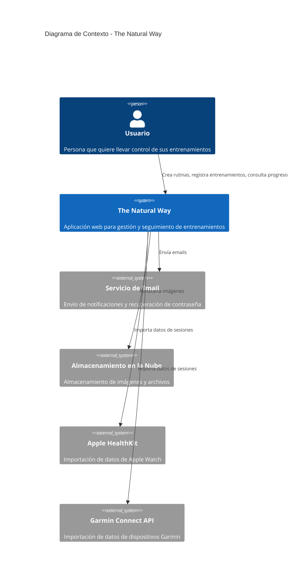

# **The Natural Way** Project Requirements Document (PRD)

**The Natural Way** es una **aplicación web** para **usuarios generales que quieran llevar un control de sus entrenamientos y ejercicios** que _permite a los usuarios crear, registrar, monitorizar y analizar sus rutinas de entrenamiento para mejorar su progreso físico_.

## Funcionalidades

### 1. GESTIÓN DE USUARIOS

- Sistema de registro e inicio de sesión con autenticación JWT
- [1_gestion_de_usuarios](pendiente)
- Estado: draft

### 2. BIBLIOTECA DE EJERCICIOS

- Crear y gestionar una biblioteca de ejercicios personalizados
- [2_biblioteca_de_ejercicios](pendiente)
- Estado: draft

### 3. CREAR RUTINAS DE ENTRENAMIENTO

- Diseñar y configurar rutinas de entrenamiento personalizadas utilizando ejercicios de la biblioteca
- [3_crear_rutinas_de_entrenamiento](pendiente)
- Estado: draft

### 4. REGISTRAR SESIONES DE ENTRENAMIENTO

- Registrar y documentar sesiones de entrenamiento completadas con datos detallados
- [4_registrar_sesiones_de_entrenamiento](pendiente)
- Estado: draft

### 5. SEGUIMIENTO DE PROGRESO

- Visualizar y monitorizar la evolución del rendimiento físico a lo largo del tiempo
- [5_seguimiento_de_progreso](pendiente)
- Estado: draft

### 6. ESTADÍSTICAS Y ANÁLISIS

- Generar informes estadísticos y análisis avanzados del progreso y rendimiento
- [6_estadisticas_y_analisis](pendiente)
- Estado: draft

## Diagrama de contexto

---

## Especificaciones del sistema y contenedores

- **Interacción**: web, API REST
- **Niveles**: multi-tier
- **Autenticación**: JWT
- **Integraciones**: Almacenamiento en la nube, servicios de email, APIs de dispositivos wearables (Apple HealthKit, Garmin Connect)
- **Monitorización**: operativa
- **Persistencia**: base de datos PostgreSQL

### C_1: BACKEND API

- Un Django REST Framework que gestiona la lógica de negocio, autenticación JWT, integración con servicios externos y operaciones CRUD

### C_2: BASE DE DATOS

- Un PostgreSQL que almacena de forma persistente usuarios, ejercicios, rutinas, sesiones de entrenamiento y datos de progreso

### C_3: FRONTEND

- Un Next.js (React framework) que proporciona la interfaz de usuario web, renderizado del lado del servidor y experiencia de usuario optimizada

## Créditos

- **Autor**: [José Sancho Monrabal](https://github.com/jsmdev)
- **Repositorio**: [The Natural Way Backend](https://github.com/jsmdev/thenaturalway-backend.git)

## Referencias de contexto

- [Modelo de Dominio](./DOMAIN.md) - Modelo de datos del proyecto con entidades, atributos, relaciones y diagrama ER