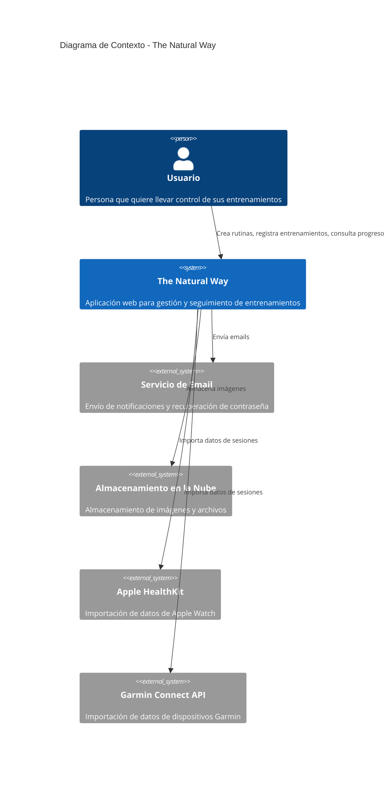

# **The Natural Way** Project Requirements Document (PRD)

**The Natural Way** es una **aplicación web** para **usuarios generales que quieran llevar un control de sus entrenamientos y ejercicios** que _permite a los usuarios crear, registrar, monitorizar y analizar sus rutinas de entrenamiento para mejorar su progreso físico_.

## Funcionalidades

### 1. GESTIÓN DE USUARIOS

- Sistema de registro e inicio de sesión con autenticación JWT (API REST)
- Interfaz web con templates Django para registro, login, logout y gestión de perfil
- [1_gestion_de_usuarios#2](https://github.com/jsmdev/thenaturalway-backend/issues/2)
- Estado: builder-planned
- [Plan de Implementación](./features/1_gestion_de_usuarios/plan.md)

### 2. BIBLIOTECA DE EJERCICIOS

- Crear y gestionar una biblioteca de ejercicios personalizados
- [2_biblioteca_de_ejercicios#3](https://github.com/jsmdev/thenaturalway-backend/issues/3)
- Estado: builder-planned
- [Plan de Implementación](./features/2_biblioteca_de_ejercicios/plan.md)

### 3. CREAR RUTINAS DE ENTRENAMIENTO

- Diseñar y configurar rutinas de entrenamiento personalizadas utilizando ejercicios de la biblioteca
- [3_crear_rutinas_de_entrenamiento#4](https://github.com/jsmdev/thenaturalway-backend/issues/4)
- Estado: builder-planned
- [Plan de Implementación](./features/3_crear_rutinas_de_entrenamiento/plan.md)

### 4. REGISTRAR SESIONES DE ENTRENAMIENTO

- Registrar y documentar sesiones de entrenamiento completadas con datos detallados
- [4_registrar_sesiones_de_entrenamiento#5](https://github.com/jsmdev/thenaturalway-backend/issues/5)
- Estado: builder-implemented
- [Plan de Implementación](./features/4_registrar_sesiones_de_entrenamiento/plan.md)

### 5. SEGUIMIENTO DE PROGRESO

- Visualizar y monitorizar la evolución del rendimiento físico a lo largo del tiempo
- [5_seguimiento_de_progreso#6](https://github.com/jsmdev/thenaturalway-backend/issues/6)
- Estado: defined

### 6. ESTADÍSTICAS Y ANÁLISIS

- Generar informes estadísticos y análisis avanzados del progreso y rendimiento
- [6_estadisticas_y_analisis#7](https://github.com/jsmdev/thenaturalway-backend/issues/7)
- Estado: defined

## Diagrama de contexto

---

## Especificaciones del sistema y contenedores

- **Interacción**: web (templates Django), API REST
- **Niveles**: multi-tier
- **Autenticación**: JWT (para API), Session-based (para web)
- **Integraciones**: Almacenamiento en la nube, servicios de email, APIs de dispositivos wearables (Apple HealthKit, Garmin Connect)
- **Monitorización**: operativa
- **Persistencia**: base de datos PostgreSQL

### C_1: BACKEND API

- Un Django REST Framework que gestiona la lógica de negocio, autenticación JWT, integración con servicios externos y operaciones CRUD
- Endpoints REST disponibles en `/api/*` para integración con aplicaciones móviles o frontend separado

### C_2: BACKEND WEB

- Vistas Django tradicionales con templates HTML que proporcionan interfaz web completa
- Endpoints web disponibles en rutas sin prefijo `/api/*` (ej: `/users/register/`, `/users/login/`)
- Autenticación basada en sesiones para la parte web
- Reutiliza la misma lógica de negocio (services y repositories) que la API REST

### C_3: BASE DE DATOS

- Un PostgreSQL que almacena de forma persistente usuarios, ejercicios, rutinas, sesiones de entrenamiento y datos de progreso

### C_4: FRONTENDS EXTERNOS (Opcionales)

El backend está diseñado para soportar múltiples frontends externos simultáneamente:

- **Frontend React/Vue/Next.js**: Aplicaciones web modernas en proyectos separados que consumen `/api/*`
- **Frontend Laravel/PHP**: Aplicaciones web en PHP que consumen `/api/*`
- **Aplicaciones Móviles**: iOS/Android que consumen `/api/*`
- **Cualquier otro cliente**: Que consuma la API REST estándar

**Características:**
- Todos los frontends externos consumen la misma API REST (`/api/*`)
- Autenticación mediante JWT tokens
- Configuración CORS para permitir múltiples orígenes
- Cada frontend puede desarrollarse, desplegarse y mantenerse independientemente
- Pueden coexistir múltiples frontends sin conflictos

**Nota**: Los templates Django (`/*`) y los frontends externos (`/api/*`) pueden convivir perfectamente, ya que usan rutas diferentes y sistemas de autenticación independientes.

## Créditos

- **Autor**: [José Sancho Monrabal](https://github.com/jsmdev)
- **Repositorio**: [The Natural Way Backend](https://github.com/jsmdev/thenaturalway-backend.git)

## Referencias de contexto

- [Modelo de Dominio](./DOMAIN.md) - Modelo de datos del proyecto con entidades, atributos, relaciones y diagrama ER